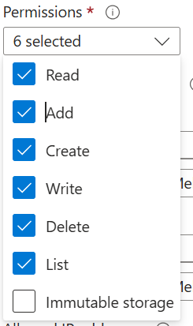

# AzureAI-RAG-Multimodal
Azure AI Solutions with RAG with Multimodal data such as Images, Text and retrieving Multimodal Results

## Step 1
Create an Azure Storage Account and a Container to store the PDF content to be parsed.  
> How to: [Create an Azure Storage Account](https://learn.microsoft.com/en-us/azure/storage/common/storage-account-create?tabs=azure-portal)

Create two folders in it as below:
- raw_data
- prepared_data

- Generate a SAS URI for the blob container with the following permissions:
    - Read
    - Write
    - List
    - Delete
- Refer to the image below for the required permissions:
    
- Follow this guide to create SAS tokens for Azure Storage: [Create SAS tokens for Azure Storage](https://learn.microsoft.com/en-us/azure/ai-services/translator/document-translation/how-to-guides/create-sas-tokens?tabs=Containers)

## Step 2
Create an Azure AI Search Service (if not done before, use the below reference quickstart)
> [Quickstart: Create an Azure Cognitive Search service in the Azure portal](https://learn.microsoft.com/en-us/azure/search/search-create-service-portal)

## Step 3
Create an Azure Open AI resource (recommendeded:Use Azure AI Foundry Project) and deploy the below models in the same region as Azure AI Search above.

1. text-embedding-3-small
2. gpt-4o-mini

## Step 4
- Copy the `.env-sample` file and paste it in the same folder.
- Rename the copied file to `.env`.
- Fill the values in the `.env` file with values from Azure Resources where not available.

## Step 5
- Upload the PDF documents to the `raw_data` folder.
- Run the `split-pdf.py` file to split the PDF into JSON files and images.
- Ensure the `prepared_data` folder contains:
    - A `Text` folder with JSON files.
    - An `Images` folder with images.

- Run the `searchsetup.py` script to:
    - Create the Data Sources.
    - Configure Skills.
    - Set up the Indexer.
    - Create the Index in the Azure AI Search instance.
- Verify the Indexer run has completed successfully.
- Ensure documents have been crawled and are present in the Index.

## Step 7
- Run the Streamlit debugger to execute `app.py`.
- Open the web page with the Search box.
- If issues occur:
    - Check the Terminal in VS Code or your IDE for more details.

